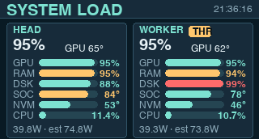
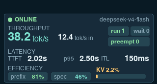
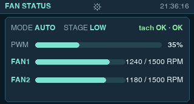
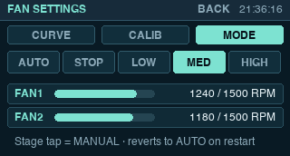

# GB10 cluster dashboard

The ESP32 display runs in 90-degree landscape mode at 320 x 172. The display
and AXS5106L touch coordinates use the same rotation transform from the
Waveshare BSP.

The firmware connects to Wi-Fi and reads:

```text
http://192.168.88.181:9108/status
```

The read-only service runs as a user service on `gb10`. For each host (local
head node and SSH-reachable worker) it reports:

- GPU temperature, utilization, board power (`power.draw`), current and max SM
  clocks, thermal-throttle and power-cap throttle flags, and GPU-allocated
  memory (the `--query-compute-apps` sum, `gpu_mem_mb`);
- SoC/ACPI thermal-zone peak (`cpu_temp_c`), CPU utilization, estimated
  whole-node draw (`power_sys_est_w`, modeled after the sparkDash fleet-energy
  formula and labeled as an estimate);
- RAM use plus total/available pool size, NVMe composite temperature, root
  filesystem use, disk and network throughput (kB/s), load, and uptime;
- DeepSeek running/waiting requests, KV cache use, prompt and generation token
  rates, TTFT mean (recent window, cumulative fallback) and p95, inter-token
  latency p95, preemption counter, prefix-cache hit rate, and speculative
  decoding acceptance rate.

Fields a source cannot provide are `null`, never zero-faked. The service does
not mutate model containers or deployment configuration.

## Display pages

The 320 x 172 UI merges the title and status line into one top band: page
title left, status timestamp right. It has three carousel pages plus fan
settings screens:

- `SYSTEM LOAD`: per host, a hero GPU-utilisation readout with GPU
  temperature beside it and six metric bars — GPU utilisation (cyan),
  RAM and root-disk use (amber at 90 percent, red at 97), SoC and NVMe
  temperature on a 0-100 degree scale (amber at 80, red at 95), and CPU load
  — plus a footer line with board power, the estimated whole-node draw, and
  uptime. An amber `THR` badge appears while the GPU reports thermal or
  power-cap throttling.
- `MODEL INFERENCE`: three labelled zones — THROUGHPUT (generation tok/s
  hero, prompt rate), LATENCY (TTFT mean, TTFT p95, inter-token p95), and
  EFFICIENCY (prefix-hit and speculative-accept chips, plus a separate amber
  KV-cache pressure bar). A status dot and model name sit in the header;
  running/waiting/preemptions render as chips that colour under pressure.
- `FAN STATUS`: mode and stage chips, tach health, a PWM bar, per-fan RPM
  against the configured full-speed reference, and the red fault banner while
  the controller forces full speed.
- `FAN SETTINGS` (outside the carousel): curve bounds, calibration
  references, and mode selection with live per-fan RPM rows. Reached from the
  centred gear on `FAN STATUS`; `BACK` returns and rotation resumes. Curve
  and reference rows open edit screens (top-right `BACK`, long-press repeat
  on the +/- buttons) with save/cancel; changes persist in NVS.

Approved 1:1 design mockups live in `output/review/` and match the shipped
firmware:






There is no bottom navigation. The three status pages rotate automatically
and any tap advances to the next page. The browser mirror reproduces the
SYSTEM and MODEL pages in the same style; fan telemetry lives on the device
and is not part of `/status`, so the mirror does not render a fan page.

The status service supplies the page interval to both clients through the
`page_rotation_ms` field. A tap anywhere on a carousel page advances
immediately and resets the timer. The firmware falls back to ten seconds
when the field is absent or outside the supported 1-300 second range. The
firmware polls `/status` every two seconds; the mirror refreshes on the same
cadence.

Wi-Fi credentials live only in the ignored file
`firmware/touch-demo/main/wifi_credentials.h`. The tracked
`wifi_credentials.example.h` documents the required defines.

## Web display mirror

Open the following URL from the LAN:

```text
http://192.168.88.181:9108/
```

The page reproduces both 320 x 172 LCD pages, scales them to fit the browser
viewport, and refreshes the same status data every two seconds. It follows the
same service-configured rotation and supports click or touch to advance. It has no
external assets or build dependencies.

## Configure page rotation

Set `--page-rotation-seconds` on the status service. Valid values are integers
from 1 through 300; the tracked service unit defaults to 10:

```text
ExecStart=/usr/bin/python3 /home/chriswang/cluster-display-status/cluster_status_server.py --host 0.0.0.0 --port 9108 --page-rotation-seconds 10
```

After changing the installed unit, reload and restart only this user service:

```bash
systemctl --user daemon-reload
systemctl --user restart cluster-display-status.service
```

## Service operations

```bash
ssh gb10 'systemctl --user status cluster-display-status.service'
ssh gb10 'curl -fsS http://127.0.0.1:9108/status'
ssh gb10 'systemctl --user restart cluster-display-status.service'
```
