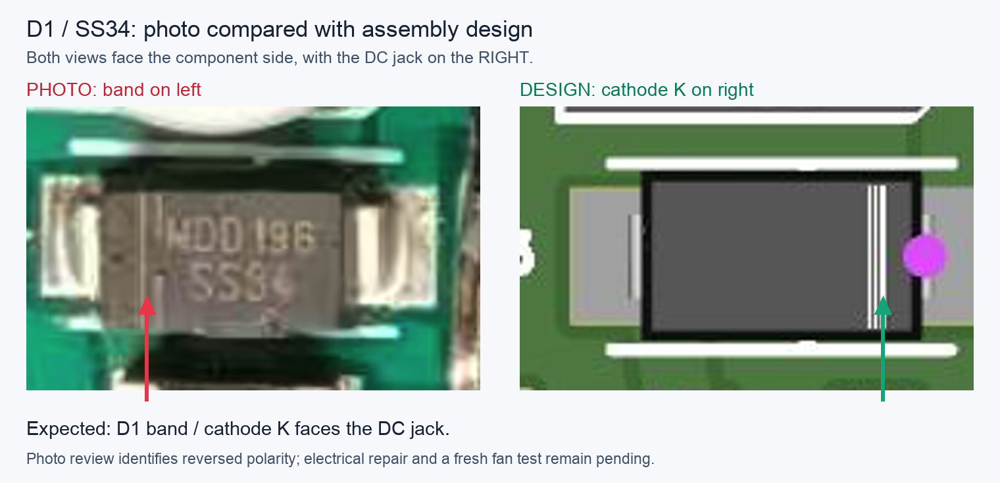

# Rev B 首板排查，2026-09-15

当前制造基线是 `hardware/fan-interface-revB/release-20260909-dfm5`。
本次未修改已送厂的 PCB、Gerber、BOM 或 CPL。用户确认两只风扇、独立 12 V
和 ESP32 USB 均已接好，风扇仍未转；没有万用表。

## 首要发现：D1 反向安装

最新实物照片 `codex-clipboard-c418e8b3-3762-4fb8-a31f-af93e68d3249.png`
旋转 180° 后，DC 插座在右，方向与制造版底面装配图一致。
实物 SS34 本体的阴极色带在左；设计的阴极在右、靠近 DC 插座。
实物色带应朝向 DC 插座。本结论同时依据原生 PCB 焊盘网络和底面制造图，
不是仅凭 CPL 的旋转角度推断。



原生网络为：

```text
J1.1 VIN12_RAW -> F1 -> VIN12_PROT -> D1.2 (A)
                                    D1.1 (K) -> FAN12 -> J2.2 / J3.2
J1.2 GND --------------------------------------------> J2.1 / J3.1
J1.3 switched sleeve: NC
```

D1 是两只风扇共用的串联保护二极管。反向安装会阻断正常的正向供电，足以解释
两只风扇同时不转。仍需纠正后的实测确认是否还有虚焊等其他问题。
此前对 D1 方向正常的口头判断被这次放大复核推翻。

其他复核结果：

- 两个风扇座的定位结构与制造版一致，未见 180° 反焊证据。
- J2/J3 均为 1 GND、2 FAN12、3 独立 TACH、4 共用 PWM。
- C1 的负极黑色标记在同方向视图的左侧，与设计一致。
- F1、D1、C1、Q1 等元件在照片中可见，但照片不能证明焊点导通。
- 原生审计的 40 个电气引脚映射无差异，排母排距 17.00000156 mm。
- [DC 插座原厂图](../hardware/fan-interface-revB/reference/components/DC005.pdf)
  确认 pin 1 中心触点、pin 2 外壳触点、pin 3 开关触点，PCB 没有混用开关脚。

## 固件诊断纠正

目标是 `gb10-2:/home/admin/project/esp32-s3-touch-1.47`，ESP32 重新接回后为
`/dev/ttyACM0`，USB VID:PID `303a:1001`。

原始诊断 `29be4c9` 和随后未提交的释放测试存在以下问题，本次一并纠正：

1. 远程 ESP-IDF 的 `esp_driver_gpio/src/gpio.c` 中，`gpio_reset_pin()`
   会开启内部上拉。释放后显式设为 `GPIO_FLOATING`，关闭上拉/下拉，才可让
   板上 100 kΩ 下拉控制 Q1。此前“高阻释放已排除控制问题”的推断无效。
2. 原公式把 5 秒内的脉冲数乘以 120 / PPR，非零 RPM 会放大 10 倍。
   现在按实际微秒采样间隔计算 `pulses * 60000000 / (elapsed_us * PPR)`，
   并在释放测试后重新建立计数和时间基准。例如每转 2 脉冲，5 秒内 250 脉冲
   应为 1500 RPM。每转 2 脉冲仍是待实物校准的假设。
3. 原相位取模会反复进入半速，与代码注释不符。现在只执行一次全速、半速、
   全速，然后持续请求全速并记录两个 TACH 输入。

修正源码已同步至 GB10-2，`./scripts/build.sh` 成功，镜像大小 `0x129ec0`。
证据见 [构建记录](evidence/20260915-fan-review-build.txt)。
构建源码 SHA-256：`dff84efb82c41da92c7da282a10508d69e626ad84486636247d872d4da51fbfe`；
镜像 SHA-256：`9b1517ae985a72a846c6fab4395e81e2e24fca972a032151ddca3ceee4906a5d`。
制造发布目录现有校验清单的 48 个文件全部匹配，没有改写已送厂文件。
发现 D1 反向后要求用户先断开独立 12 V 和 USB，因此本次修正版**尚未刷入**。
代码编译通过不代表风扇端已有 25 kHz 波形或两路测速电路已经通过实测。

前阶段的串口结果是两路 `0 pulses / 0 RPM / level=1`，只证明当时没有检测到
下降沿；不证明风扇供电、PWM 电压、线路连续性或非零 RPM 换算正确。

## 恢复顺序

1. 断开独立 12 V 和 ESP32 USB，完全断电后处理 D1。
2. 将 SS34 在板面内旋转 180° 重焊，色带端朝 DC 插座；不用短接 D1/F1。
3. 检查两端焊点、焊盘和邻近 C1/J1，确认无桥连。焊盘受损时先修复连接。
4. 冷却后恢复现有连接，刷入修正版，记录释放、全速、半速、最终全速状态。
5. 只有风扇实际转动、两路出现合理且随转速变化的脉冲，才继续确认调速和测速。
   若仍不转，下一步需测 J1、F1、D1、FAN12 与 GND 的连续性/电压，以及 PWM_BUS；
   照片和 ESP32 日志不能替代这些测量。

## 当前请求验收

`baseline_revision: fan-bringup-20260915-r1`；权威来源是本任务中用户的明确请求，
不是新产品设计。相关原话冻结为以下故事；无需为这次排查重复批准。

| Story ID / 用户原话 | Given | When | Then / 当前证据 | 状态 |
|---|---|---|---|---|
| FAN-01：确认一下风扇的插座有没有焊接反 | 提供实物照片 | 对照同方向的制造版定位结构和脚序 | 未见风扇座反焊证据；图像及原生引脚核对完成 | Complete（目视评审） |
| FAN-02：对照图片重新评审一下 pcb 的设计，看看有没有问题 | Rev B DFM5 已制造、手焊 | 对照 PCB、极性标记和原厂脚位图 | 发现 D1 实物极性相反；更正先前判断，未发现本次所核对网络的设计差异 | Complete（评审） |
| FAN-03：esp 是否可以读到风扇转速，并且驱动风扇转动 | 两风扇及独立 12 V 接入 | 执行释放、调速与两路测速 | 尚无风扇转动/非零测速证据；D1 待返焊，修正版待刷入 | Partial |

评审结果已落实；整体验收 drift score = 3，Gate = DRIFTED，不能宣布硬件调试完成。
已纠正诊断程序的上拉、RPM 公式及循环测试偏移；当前具体阻塞是需要实物返焊 D1，
随后再进行固件刷写和电气实测。无需改变用户故事或启动新 PCB 修订。
