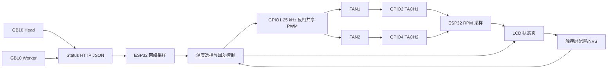

# ESP32 双 GB10 温度联动风扇控制设计（r3）

## 目标

在现有 ESP32-S3-Touch-LCD 与 Rev B 转接板上增加自动风扇控制：显示两台 GB10 温度，按温度控制两只共享 PWM 的风扇，最低档停转；共享曲线的档位边界和级别可从触摸屏调整并持久化。两路 TACH 仍分别显示 RPM。

基线：`fan-control-20260916-r3`。相关故事为 FANCTRL-01、FANCTRL-02、FANCTRL-03、FANCTRL-06、FANCTRL-07；故障回退规则属于 FANCTRL-04，需用户确认后冻结。

## 推荐控制规则

1. 每 2 秒读取一次状态 JSON，并在屏幕上同时显示两台温度；取 `max(head.temp_c, worker.temp_c)` 作为共享控制温度。
2. 共享四档默认值：`STOP 0% ≤ 45°C`、`LOW 35% 46–55°C`、`MED 65% 56–65°C`、`HIGH 100% ≥ 66°C`。界面允许修改共享曲线的每档上限；保存时强制边界递增且级别不下降。
3. 使用 3°C 回差：升档使用上限，降档使用上限减 3°C。控制温度连续 2 个样本满足条件才切档。
4. 从 STOP 进入任意运行档时，先全速运行 1 秒再切到目标档，避免风扇低占空比无法启动。
5. PWM 使用 Rev B 的 GPIO1、25 kHz、反相开漏输出；两只风扇同步调速。GPIO2/4 仍分别读取 FAN1/FAN2 TACH，仅用于 RPM 显示和测速异常提示。
6. FAN1/FAN2 的 TACH 分别显示 RPM；每只风扇保存独立的全速参考 RPM，用于显示相对转速和测速异常提示，不用于改变共享 PWM 档位。任一路连续 3 个采样窗口无脉冲时只标记该风扇测速异常，不因单路 TACH 误报而停机。

## 触摸屏信息架构

- **SYSTEM LOAD 页**：保留现有 GB10 系统负载监控内容和页面轮换行为。
- **MODEL INFERENCE 页**：保留现有模型状态和吞吐监控内容。
- **FAN STATUS 页**：显示两台 GB10 温度、控制温度、共享档位、共享 PWM、FAN1/FAN2 原始 RPM、各自相对全速百分比和测速状态。
- **FAN SETTINGS 页**：分为“温控曲线”“风扇校准”“控制模式”三组。温控曲线编辑共享四档边界和回差；风扇校准分别编辑 FAN1/FAN2 全速参考 RPM；控制模式提供自动/手动。
- **触控导航**：主导航只有 `系统`、`模型`、`风扇` 三页；监控两页继续支持点击切换。FAN STATUS 标题栏提供 `设置` 按钮，进入 FAN SETTINGS 二级页；设置页提供“返回风扇状态”，保存后显示确认，取消不写入 NVS。自动轮换只作用于两页监控页，不自动跳入风扇或设置。
- **故障态**：状态接口超时、温度无效或 Wi-Fi 断开时，状态页顶部显示故障条，并按确认后的安全策略执行回退。

## 模块与数据流

网络采样、控制状态、UI 和 NVS 配置应拆成独立模块，避免把控制时序放进 LVGL 回调。控制模块只接收温度样本和配置，输出 PWM 档位；UI 只提交经过校验的配置变更。

## 需要确认的产品规则

1. 是否接受“取两台 GB10 最高温度控制两只共享 PWM 风扇”的策略？
2. 故障回退是否确认采用“网络/温度异常立即全速，屏幕显示故障，重启后回自动”？
3. 四档默认温度和占空比是否作为首版默认值，还是需要指定另一组？

## 验收计划

- 模拟温度序列覆盖升温、降温、边界抖动、STOP→运行 kick-start。
- 在实机上验证四个档位的 PWM 与两路 RPM，确认停止后可重新启动。
- 断开状态服务和 Wi-Fi，验证故障显示及回退行为。
- 修改配置、重启 ESP32，确认 NVS 持久化且非法边界无法保存。
